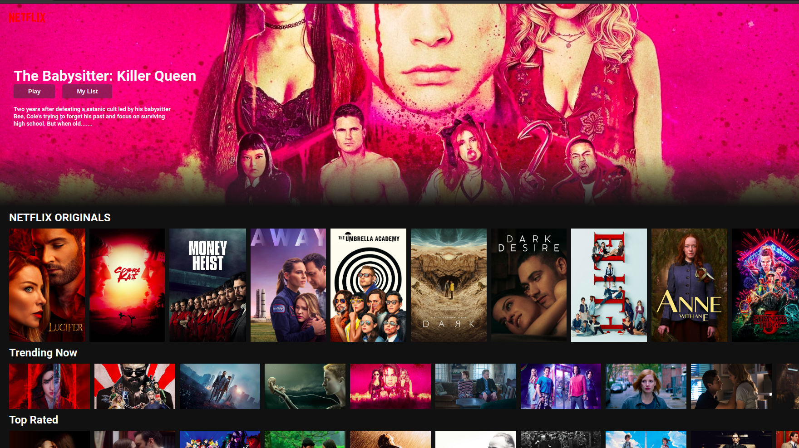

## Available Scripts

In the project directory, you can run:

### `npm start`

Runs the app in the development mode. 
Open [http://localhost:3000](http://localhost:3000) to view it in the browser.

### Below is a Imgae of the frontpage of the Website

### The website is also live at below link
https://nileshpant-wlmykb.web.app/
